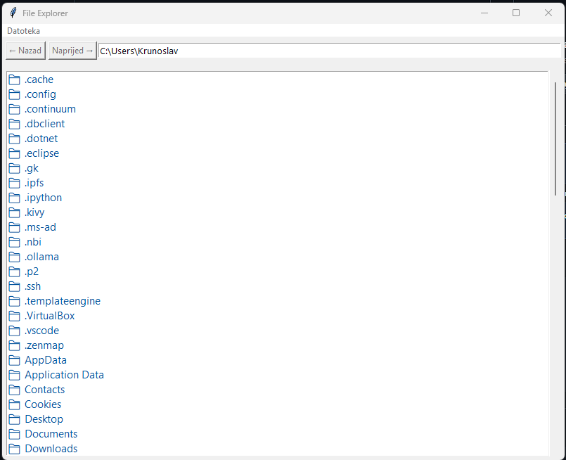

# File Explorer 🗂️

Jednostavan Python program za pregled i upravljanje datotekama putem grafičkog sučelja.

## 📌 Značajke
- Pregled datoteka i mapa
- Otvaranje datoteka izravno iz aplikacije
- Brzo pretraživanje
- Prikaz slika i dokumenata
- Kliknut na Datoteka, tu su opcije stvori novo i izađi

## 🖼️ Izgled aplikacije


## 🚀 Instalacija
1. Kloniraj repozitorij:
   ```bash
   git clone https://github.com/amancyber42/file-explorer.git
   
   cd file-explorer

   python file_explorer.py